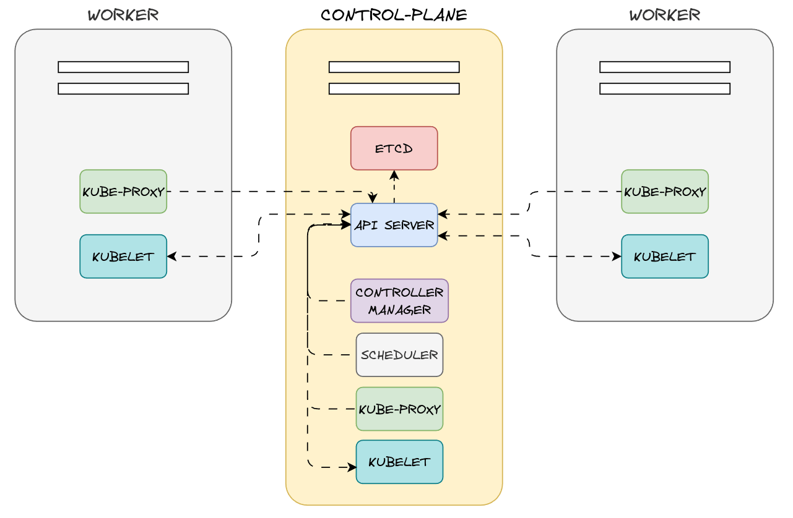

# Certificates

## Videos

| English | Portuguese |
|----------|:-------------:|
| [](https://youtu.be/xxxxxxx) | [](https://youtu.be/xxxxxxx)


## Cluster Components




## Creating Certificates

### Certificate Authority (CA)

- Key
```
openssl genrsa -out ca.key 2048
```

- Certificate Sign Request
```
openssl req -new -key ca.key -subj "/CN=KUBERNETES-CA" -out ca.csr
```

- Sign Certificate
```
openssl x509 -req -in ca.csr -signkey ca.key -out ca.crt
```

### Admin User

- Key
```
openssl genrsa -out marcelo.key 2048
```

- Certificate Sign Request
```
openssl req -new -key marcelo.key -subj "/CN=marcelo/O=system:masters" -out marcelo.csr
```

- Sign Certificate
```
openssl x509 -req -in marcelo.csr -days 365 -CA ca.crt -CAkey ca.key -out marcelo.crt
```

### Commands to Test the Certificates

- curl without certificate

```
curl https://172.16.16.100:6443/api/v1/nodes -k
```

- curl with certificate

```
curl https://172.16.16.100:6443/api/v1/nodes --key marcelo.key --cert marcelo.crt --cacert ca.crt
```

- curl with certificate and a node name filter using jq
```
curl -s https://172.16.16.100:6443/api/v1/nodes --key marcelo.key --cert marcelo.crt --cacert ca.crt | jq '.items[].metadata.name'
```

- Testing with Kubectl

```
kubectl get nodes --server https://172.16.16.100:6443 --client-key marcelo.key --client-certificate marcelo.crt --certificate-authority ca.crt
```


## References

- [SSL, TLS, HTTPS Explained](https://youtu.be/j9QmMEWmcfo)
- [Generate Certificates Manually](https://kubernetes.io/docs/tasks/administer-cluster/certificates/)
- [Certificate Management with kubeadm](https://kubernetes.io/docs/tasks/administer-cluster/kubeadm/kubeadm-certs/)
