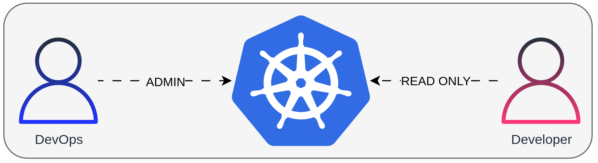

# Certificate Signing Requests

## Videos

| English | Portuguese |
|----------|:-------------:|
| [](https://youtu.be/xxxxxxxxxxx) | [](https://youtu.be/xxxxxxxxxxx)

## Challenge

The main idea of this topic is to explain the concepts of certificate signing requests and, using this knowledge, create access to two different roles in the Kubernetes cluster.
Let's create a scenario with a DevOps and a developer professional who demands certain permissions. The first one needs full access, and the second one should be able to only read Kubernetes objects.




## Creating Certificate Signing Requests


### DevOps

- Keys:
```
openssl genrsa -out devops.key 2048
```

- Certificate Sign Request:
```
openssl req -new -key devops.key -subj "/CN=devops" -out devops.csr
```

- Certificate Signing Request:
```
cat <<EOF >kube-csr-devops.yaml
apiVersion: certificates.k8s.io/v1
kind: CertificateSigningRequest
metadata:
  name: devops
spec:
  request: $(cat devops.csr|base64 -w0)
  signerName: kubernetes.io/kube-apiserver-client
  expirationSeconds: 31536000 # 1 year
  usages:
  - client auth
EOF
```
- Apply, Approve and get the Certificate:
```
kubectl apply -f kube-csr-devops.yaml
kubectl get csr
kubectl certificate approve devops
kubectl get csr devops -o jsonpath='{.status.certificate}'|base64 -d>devops.crt
openssl x509 -text -noout -in devops.crt
```

> [!NOTE]  
> Tip: there is a graphical tool to inspect the certificates called `xca`

- Get apiserver address:

```
kubectl cluster-info # to get the apiserver address
APISERVER_ENDPOINT=https://127.0.0.1:
```
> [!IMPORTANT]  
> Check with the following command if you can reach the apiserver endpoint: `curl -k $APISERVER_ENDPOINT/version`

- Get the root CA certificate of the cluster:

If you already have kubectl configured, use this command:
```
CLUSTER_CA_BASE64=$(kubectl config view --raw -o jsonpath="{.clusters[0].cluster.certificate-authority-data}")
```

> [!WARNING]  
> If you have multiple clusters defined, you might need to adjust the index (e.g., `[0]`) to select the appropriate cluster.

- Create kubeconfig:

```
cat <<EOF >devops.kubeconfig
apiVersion: v1
clusters:
- cluster:
    server: $APISERVER_ENDPOINT
    certificate-authority-data: $CLUSTER_CA_BASE64
  name: mycluster
contexts:
- context:
    cluster: mycluster
    namespace: default
    user: devops
  name: mycluster-devops
current-context: mycluster-devops
kind: Config
preferences: {}
users:
- name: devops 
  user:
    client-certificate-data: $(cat devops.crt|base64 -w0)
    client-key-data: $(cat devops.key|base64 -w0)
EOF
```

- Admin permissions:

```
kubectl create clusterrolebinding devops --clusterrole=cluster-admin --user=devops
```

- Test kubeconfig:

```
kubectl get pods -A --kubeconfig devops.kubeconfig
kubectl get secrets -A --kubeconfig devops.kubeconfig
kubectl run pod-test --image=nginx:alpine --kubeconfig devops.kubeconfig
kubectl auth can-i delete pod --kubeconfig devops.kubeconfig
```

### Developer

- Keys:
```
openssl genrsa -out developer.key 2048
```

- Certificate Sign Request:
```
openssl req -new -key developer.key -subj "/CN=developer" -out developer.csr
```

- Certificate Signing Request:
```
cat <<EOF >kube-csr-developer.yaml
apiVersion: certificates.k8s.io/v1
kind: CertificateSigningRequest
metadata:
  name: developer
spec:
  request: $(cat developer.csr|base64 -w0)
  signerName: kubernetes.io/kube-apiserver-client
  expirationSeconds: 31536000 # 1 year
  usages:
  - client auth
EOF
```
- Apply, Approve and get the Certificate:
```
kubectl apply -f kube-csr-developer.yaml
kubectl get csr
kubectl certificate approve developer
kubectl get csr developer -o jsonpath='{.status.certificate}'|base64 -d>developer.crt
openssl x509 -text -noout -in developer.crt
```

> [!NOTE]  
> Tip: there is a graphical tool to inspect the certificates called `xca`

- Get apiserver address:

```
kubectl cluster-info # to get the apiserver address
APISERVER_ENDPOINT=https://127.0.0.1:44181
```
> [!IMPORTANT]  
> Check with the following command if you can reach the apiserver endpoint: `curl -k $APISERVER_ENDPOINT/version`

- Get the root CA certificate of the cluster:

If you already have kubectl configured, use this command:
```
CLUSTER_CA_BASE64=$(kubectl config view --raw -o jsonpath="{.clusters[0].cluster.certificate-authority-data}")
```

> [!WARNING]  
> If you have multiple clusters defined, you might need to adjust the index (e.g., `[0]`) to select the appropriate cluster.

- Create kubeconfig:

```
cat <<EOF >developer.kubeconfig
apiVersion: v1
clusters:
- cluster:
    server: $APISERVER_ENDPOINT
    certificate-authority-data: $CLUSTER_CA_BASE64
  name: mycluster
contexts:
- context:
    cluster: mycluster
    namespace: default
    user: developer
  name: mycluster-developer
current-context: mycluster-developer
kind: Config
preferences: {}
users:
- name: developer 
  user:
    client-certificate-data: $(cat developer.crt|base64 -w0)
    client-key-data: $(cat developer.key|base64 -w0)
EOF
```

- Permissions:

```
kubectl create clusterrolebinding developer --clusterrole=view --user=developer
```

- Test kubeconfig:

```
kubectl get pods -A --kubeconfig developer.kubeconfig
kubectl get secrets -A --kubeconfig developer.kubeconfig
kubectl run pod-test --image=nginx:alpine --kubeconfig developer.kubeconfig
kubectl auth can-i delete pod --kubeconfig developer.kubeconfig
```

## References

- [Certificates and Certificate Signing Requests](https://kubernetes.io/docs/reference/access-authn-authz/certificate-signing-requests/)

